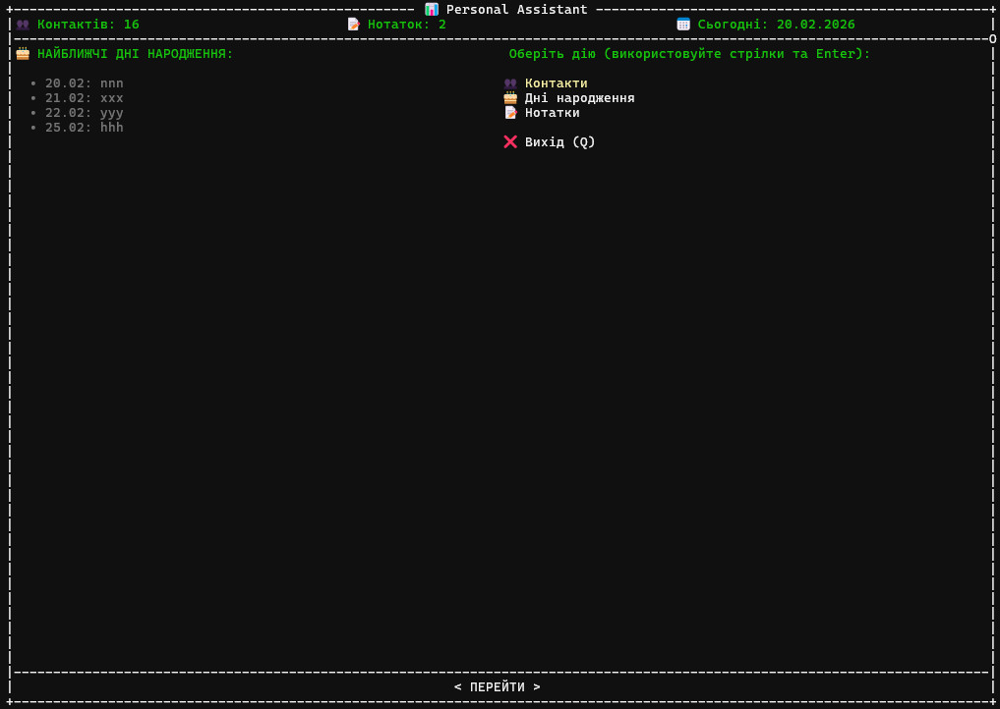
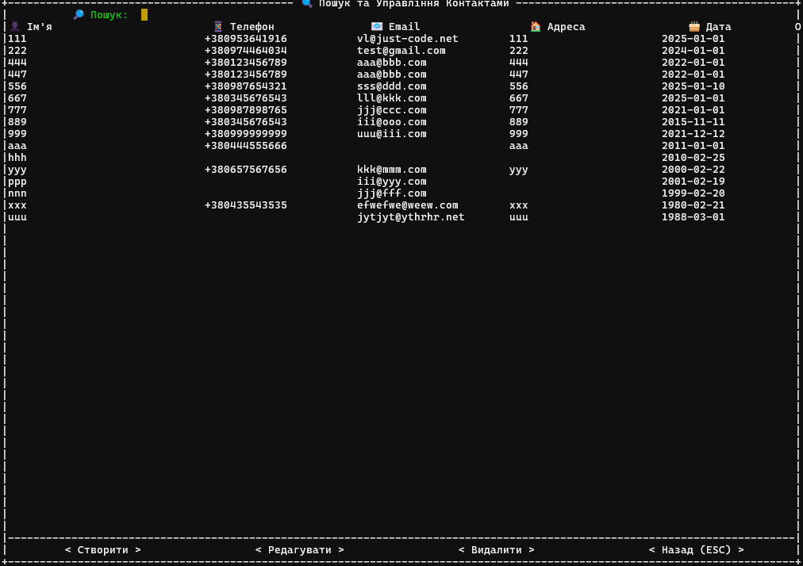
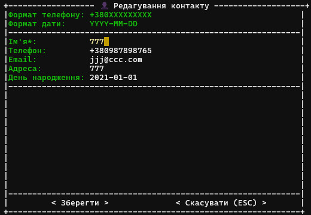

## Персональний помічник Python Programming

Встановлення:
```
git clone https://github.com/vstrelnikof/goit-pycore-hw-03.git
cd goit-pycore-hw-03
python -m venv .venv
./.venv/Scripts/activate # Per OS
python -m pip install -r requirements.txt
python main.py
```

## 🖼 TUI (terminal user interface)
### 📊 Дешборд


### 🔍 Пошук та Управління Контактами


### 👤 Форма редагування Контакту


## 🛠️ Функціональні можливості
### 📇 Контакти
- Додавання нових контактів (ім’я, телефон, email, адреса, день народження).
- Пошук контактів за ім’ям.
- Редагування та видалення контактів.
- Перевірка правильності телефону та email.
- Виведення списку контактів, у яких день народження через задану кількість днів.
### 📝 Нотатки
- Додавання текстових нотаток.
- Додавання тегів до нотаток.
- Пошук нотаток за текстом або тегами.
- Редагування та видалення нотаток.
- Сортування за тегами.

### 📂 Збереження даних
- Контакти зберігаються у файлі data/contacts.json.
- Нотатки зберігаються у файлі data/notes.json.
- Дані не втрачаються після перезапуску програми.

### 📐 Технічні особливості
- Використання TUI (terminal user interface) за допомогою asciimatics.
- Використання ООП (класи BaseModel, Contact, Note, BaseService, AddressBookService, NotesService).
- Валідація для телефону, email та дат.
- Сучасний синтаксис Python (dataclasses, match-case, pathlib).
- Код відповідає стандартам PEP 8.
